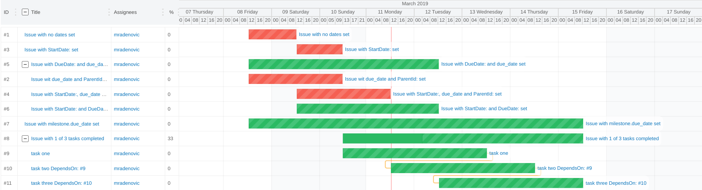

# Issuantt

It's not an ant with an issue! It's an easy to use Gantt chart for GitLab and GithHub (and possibly Bitbucket) issues.

The demo is running at [https://issuantt.gitlab.io/issuantt](https://issuantt.gitlab.io/issuantt).

The code is hosted at [https://gitlab.com/issuantt/issuantt](https://gitlab.com/issuantt/issuantt).



This project is heavily inspired by the [GanttLab-Live Project](https://gitlab.com/ganttlab/ganttlab-live) originally developed by [Pierre-Alexandre Clorichel](https://gitlab.com/clorichel).

## How to use Issuantt

### Quick Start

Add something like this to your issue description:

```text
- [x] task one
- [ ] task two
- [ ] task three

ParentId: #8
DependsOn:: #9, #10
StartDate: 2019-03-05
DueDate: 2019-03-19
```

Open [https://issuantt.gitlab.io/issuantt](https://issuantt.gitlab.io/issuantt) and search for issues, i.e.:

```text
project:your_user_name/your_project_name
```

### Search options

_Issuantt_ supports [GitlHub style issue query](https://help.github.com/en/articles/searching-issues-and-pull-requests) and [GitLab style attributes](https://docs.gitlab.com/ee/api/issues.html#list-issues).

```text
## GitLab example ##
state:opened project:issuantt/issuantt

## GitHub example ##
is:issue state:open repo:issuantt/issuantt
```

There some differences between them and the most important are listed in the table below.

|GitLab|GitHub|
|------|------|
|`group:issuantt` |`org:issuantt`|
|`project:issuantt/issuantt` |`repo:issuantt/issuantt`|
|`state:opened` |`state:open`|
|`author_id:user_id` |`author:username`|
|`assignee_id:user_id` |`assignee:username`|
|`labels:bug,critical` |`label:bug label:critical`|

### Start and Due dates

_Issuantt_ is a **frontend only** application. It leverages [GitLab API](https://gitlab.com/help/api/README.md) or [GitHub API](https://developer.github.com/v3/) to read and display your issues in a [Gantt chart](https://en.wikipedia.org/wiki/Gantt_chart). Each issue is displayed in a range from a **start date** defaulting to the issue creation date, to a **due date** defaulting to the day after that, if no other dates are set.

To give you maximum control over your issues and tasks management practices, you can override those default values **right from your issue description** with two simple [ISO 8601](https://en.wikipedia.org/wiki/ISO_8601#Calendar_dates) `YYYY-MM-DD` calendar dates:

```text
StartDate: 2019-03-05
DueDate: 2019-03-19
```

### Hierarchy and dependencies (experimental)

You can set a hierarchy and dependencies in the issue description. Both **parentId** and **dependentOn** properties of **gantt-elasstic** are undocumented and considered **experimental**. The possible result can look like something in the preview image at the [top](#Issuantt) of this page.

`ParentId` determines the hierarchy in the task list and an issue can have only one parent.

`DependsOn` determines connectors drawn in the Gantt chart and an issue can have many dependencies. However, to many dependencies can make the chart pretty messy.

Here is an example how you can set a parent and dependencies in the issue description:

```text
ParentId: #8
DependsOn:: #9, #10
```

### Task lists

Task lists are supported in both [GitlLab task lists](https://docs.gitlab.com/ee/user/markdown.html#task-lists) and [GitHub task lists](https://help.github.com/en/articles/about-task-lists). If you use those, the percentage of tasks completed will be displayed in the chart.

### Tips

The [ISO 8601](https://en.wikipedia.org/wiki/ISO_8601#Calendar_dates) format also covers times and timezones, and _Issuantt_ will use the time information if provided (default to 12:00:00AM midnight UTC). Feel free to add _down to the second_ based `StartDate` and `DueDate` like `2018-06-20T14:00:00+02:00` for UTC+2, `2018-05-15T04:00:00-04:00` in UTC-4 or `2018-05-15T04:00:00Z` for UTC/GMT.

The values of `StartDate` and `DueDate`, preferably on one dedicated line of your issue description (whether on top or bottom of the description), are considered as the _single source of truth_ if present to generate the gantt chart.

As mentioned, for a better user experience, a default Gantt chart will be created without you having to update all of your issues description to set those values: for each issue the **default start date** is read from the issue creation date. As with GitLab you are not forced to fill in a due date for your issues, and with GitHub you do not even have a due date on issues, here is the logic in place about the **default due date**:

1. if set, the `GanttDue` value is used first,
1. _(GitLab only)_ if this single source of truth is not set but you've set a due date on the issue itself, the issue due date will be used,
1. if your issue has no due date but is attached to a milestone that has a due date, the milestone due date is used,
1. ultimately, the _GanttLab Live_ **default due date** will be set to the day after the issue start date, faking all your issues having to be done in one day.

Only your opened issues are displayed. If an issue due date is past, the issue is marked late and **colored red**. If not, the issue is **shown green** as being on time.

## Project setup

The project was created with [vue-cli 3](https://cli.vuejs.org/guide/) and requires [node 8](https://nodejs.org/en/) or higher. To setup dev environment run the following commands:

```bash
# clone the repository
git clone https://gitlab.com/issuantt/issuantt.git

# cd into repository folder
cd issuantt

# optional if you want to run the dev environment
# in docker container
docker run --name=issuantt -it -p 8080:8080 --rm -w /issuantt -v $(pwd):/issuantt node:10 /bin/bash
```

After this, the following commands are available:

```bash
# Install dependencies
npm install

# Compile and hot-reload for development
npm run serve

# Compile and minifie for production
npm run build

# Run your tests
npm run test

# Lint and fixes files
npm run lint

# Run your end-to-end tests
npm run test:e2e

# Run your unit tests
npm run test:unit
```

### Customize configuration

See [Configuration Reference](https://cli.vuejs.org/config/).

## Customize Issuantt

If you need to customize Issuant, create an env file as described in [Vue Modes and Environment Variables](https://cli.vuejs.org/guide/mode-and-env.html). You can start with `.env.example`:

```bash
cp .env.example .env.local
```

Currently, the following variables can be customized:

|Key|Default|Description|
-|-|-
|`VUE_APP_CUSTOM_START_STRING`|`"StartDate:"`|The key to search for start date in the issue description|
|`VUE_APP_CUSTOM_DUE_STRING`|`"DueDate:"`|The key to search for due date in the issue description|
|`VUE_APP_CUSTOM_DEPENDS_ON_STRING`|`"DependsOn:"`|The key to search for dependencies in the issue description|
|`VUE_APP_CUSTOM_PARENT_ID_STRING`|`"ParentId:"`|The key to search for the parent issue in the issue description|
|`VUE_APP_GITLAB_URL`|`https://gitlab.com`|GitLab instance url|
|`VUE_APP_GITLAB_TOKEN`|`null`|GitLab Private Token or Personal Access Token|
|`VUE_APP_GITHUB_URL`|`https://github.com`|GitHub Enterprise Instance (**not supported yet**)
|`VUE_APP_GITHUB_TOKEN`|`null`|GitHub Personal Access Token|


## Deployment

If you fork the project on GitLab it will automaticaly deploy to [GitLab Pages](https://about.gitlab.com/product/pages/#step-3) at:
`https://<your_namespace>.gitlab.io/issuantt`

If you want to change that, check [GitLab Pages step 3](https://about.gitlab.com/product/pages/#step-3).

Any changes to `pages` branch will automatically deploy, i.e.:

```bash
git push origin pages
```
